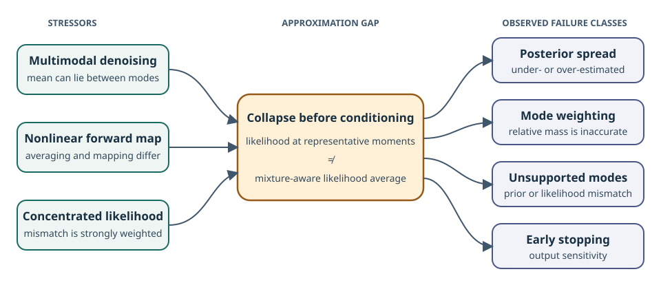

## Overview

Diffusion posterior samplers solve inverse problems by combining an unconditional
diffusion prior with an observation model. At an intermediate diffusion time
$t$, their posterior score decomposes as

$$
\nabla_{\mathbf x_t}\log p(\mathbf x_t\mid\mathbf y)
= \nabla_{\mathbf x_t}\log p(\mathbf x_t)
+ \nabla_{\mathbf x_t}\log p(\mathbf y\mid\mathbf x_t).
$$

The second term is the obstacle. It depends on the denoising likelihood

$$
p(\mathbf y\mid\mathbf x_t)
= \int p(\mathbf y\mid\mathbf x_0)
  p(\mathbf x_0\mid\mathbf x_t)\,\mathrm d\mathbf x_0,
$$

which is generally intractable. Widely used methods replace the backward
distribution with a tractable moment approximation: DPS uses a Dirac mass at
the denoiser mean, while $\Pi$GDM and TMPD use Gaussian approximations for
linear forward models. This work asks what those substitutions change, and
uses a finite-sample reference to expose the resulting errors.

## Finite-sample reference

In practice, the prior is represented by finitely many samples
$\{\mathbf x^{(i)}\}_{i=1}^N$. Replacing the unknown prior by its empirical
measure,

$$
\pi^N = \frac{1}{N}\sum_{i=1}^N\delta_{\mathbf x^{(i)}},
$$

makes the diffusion marginal a Gaussian mixture:

$$
p^N(\mathbf x_t)
= \frac{1}{N}\sum_{i=1}^N
  \mathcal N\!\left(
    \mathbf x_t;
    \sqrt{\bar\alpha(t)}\,\mathbf x^{(i)},
    (1-\bar\alpha(t))\mathbf I
  \right).
$$

Conditioning this mixture produces a discrete backward distribution
$p^N(\mathbf x_0\mid\mathbf x_t)=\sum_i w_i(\mathbf x_t)
\delta_{\mathbf x^{(i)}}$. Incorporating the observation only reweights those
same atoms:

$$
\widetilde w_i(\mathbf x_t,\mathbf y)
\propto w_i(\mathbf x_t)\,p(\mathbf y\mid\mathbf x^{(i)}).
$$

The finite-sample likelihood score is therefore available as a finite sum,

$$
\nabla_{\mathbf x_t}\log p^N(\mathbf y\mid\mathbf x_t)
= \frac{\sqrt{\bar\alpha(t)}}{1-\bar\alpha(t)}
\left(
  \sum_i \widetilde w_i\mathbf x^{(i)}
  - \sum_i w_i\mathbf x^{(i)}
\right).
$$

This is exact for the empirical prior, supports nonlinear forward models, and
converges to the population target as the empirical measure converges. It is a
controlled reference rather than a claim that a finite dataset equals the
unknown population prior. The repository implements the score and reverse-time
sampler, alongside analytic testbeds and the approximations studied in the
paper.

## Failures

Moment approximations simplify a mixture before evaluating its interaction
with the observation. A one-moment method evaluates the likelihood at the
denoiser mean; the finite-sample reference instead averages likelihood values
over prior atoms. These operations need not agree. The discrepancy is most
revealing when the denoising distribution is multimodal, the forward operator
is nonlinear, or the observation likelihood is sharply concentrated.

<figure class="well-collapse project-figure-card" markdown="0">
  
  <figcaption>Failure taxonomy synthesized from the paper's analysis. It communicates relationships, not measured magnitudes or frequencies.</figcaption>
</figure>

Failure modes

The paper diagnoses several consequences:

- **Posterior spread errors.** Approximate scores can under- or over-estimate
  uncertainty at intermediate diffusion times.
- **Incorrect mode weighting.** Relative posterior mass can be assigned
  inaccurately when the prior or posterior is multimodal.
- **Unsupported modes.** Samples can retain prior modes ruled out by the
  observation or move toward likelihood modes unsupported by the prior.
- **Early-stopping sensitivity.** Errors accumulated along the reverse process
  can make the output depend strongly on where integration is stopped.

The finite-sample reference does not remove finite-data error. Its role is to
separate that error from the additional approximation introduced by a
posterior-sampling method.

## Citation

  

    BibTeX
    <button type="button" class="btn btn-info bib-btn" data-copy-target="project-bibtex-entry" data-copy-status="project-bibtex-status">Copy</button>
    
  

  <pre><code id="project-bibtex-entry">@misc{burns2026whenwhydiffusionposterior,
  title         = {When, Why, and How Do Diffusion Posterior Samplers Fail? A Finite-Sample Lens},
  author        = {Benjamin A. Burns and Sara Fridovich-Keil},
  year          = {2026},
  eprint        = {2605.30330},
  archivePrefix = {arXiv},
  primaryClass  = {cs.LG},
  url           = {https://arxiv.org/abs/2605.30330}
}</code></pre>

